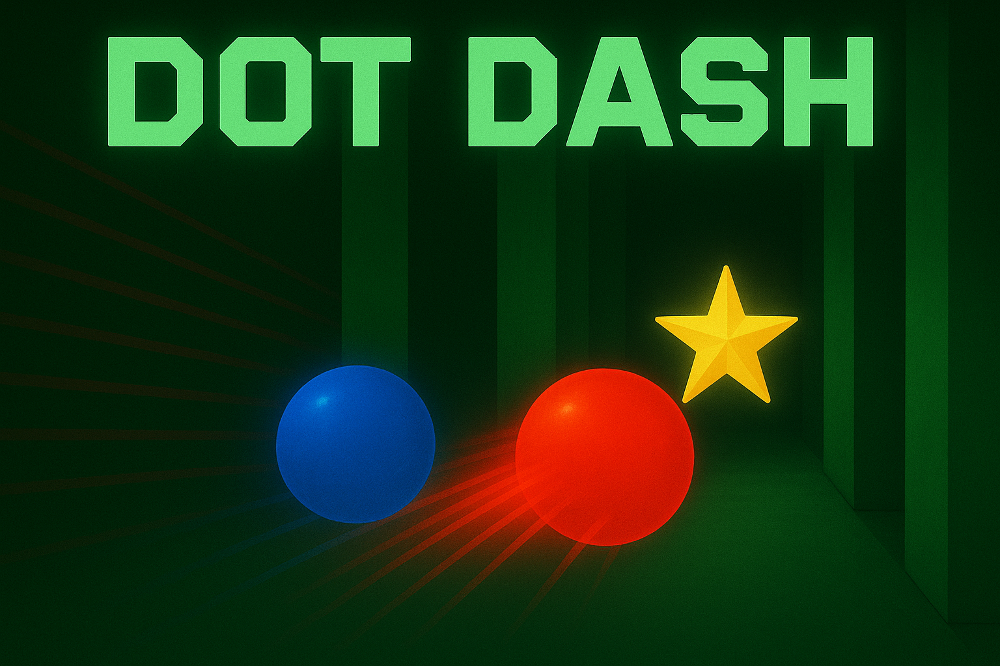

# Dot Dash



A retro-inspired two-player arcade game where each player controls a glowing orb racing through gaps in oncoming barriers. Dodge obstacles, collect items, and compete for the highest score!

---

## 🎮 Game Overview

Players guide their orbs (red for Player 1, blue for Player 2) through a vertical corridor filled with green barriers that have random gaps. Successfully passing through a barrier scores points. Collect gems, orbs, and stars for bonus points. The game ends when both players collide with obstacles.

Key features:
- Split-screen arcade action for up to two players
- Smooth HTML5 Canvas graphics with glowing effects
- Dynamic difficulty ramp: obstacles speed up and gaps shrink over time
- Controller support via the Gamepad API
- On-screen HUD: individual scores, high score, and elapsed time
- Sound effects with satisfying percussive death "bump"

---

## ⏱ How to Play

- **Movement**: Use the left analog stick on each controller to move your orb within the play area.
- **Scoring**:
  - Pass a barrier: +1 point
  - Collectable items:
    - Gem (green diamond): +1 point
    - Orb (purple circle): +5 points
    - Star (yellow star): +10 points
- **Death**: Colliding with a barrier ends your orb’s run. Game continues until both players are out.
- **Restart**: After both players die, press any button (X on PlayStation, A on Xbox) to restart.

---

## 🕹 Controls

### Input Selection
When starting the game, an input selection menu appears. Each player can choose between keyboard or gamepad:
- **Player 1**: Press WASD (keyboard) or use gamepad
- **Player 2**: Press Arrow keys (keyboard), use gamepad, or press Enter/Space to skip (single player)

### Keyboard Controls

| Action          | Player 1                          | Player 2       |
|-----------------|-----------------------------------|----------------|
| Move            | WASD                              | Arrow Keys     |
| Dash (Boost)    | Space (1P mode) / Left Shift (2P) | Right Shift    |
| Pause / Resume  | Escape                            | Escape         |
| Restart         | Space / Enter                     | Space / Enter  |

### Gamepad Controls

| Action          | PS5 Controller | Xbox Controller |
|-----------------|----------------|-----------------|
| Move            | Left stick     | Left stick      |
| Pause / Resume  | Circle (○)     | B               |
| Dash (Boost)    | Square (□)     | X               |
| Restart         | X              | A               |

---

## ⚙️ Setup & Server

A simple HTTP server is required to serve the HTML and JS files.

### Prerequisites
- [uv](https://docs.astral.sh/uv/) installed on your machine (recommended)
- Keyboard (for keyboard controls) or USB/Bluetooth gamepads (optional)

### Start a Local Server (Recommended: uv)

The easiest way to run the server is with `uv`:

```bash
cd dot-dash
uv run server.py
```

### Alternative Methods

1. **Using Python 3** (no install required):

   ```bash
   cd dot-dash
   python3 -m http.server 8000
   ```

2. **Using Node.js** (install `http-server` if needed):

   ```bash
   cd dot-dash
   npm install -g http-server   # one-time install
   http-server -p 8000
   ```

### Access the Game

Open http://localhost:8000 in your web browser.

---

## 💾 High Score & Persistence

High scores reset on page reload. For persistent storage, integrate a backend or browser localStorage.

---

## ❓ Troubleshooting

- **Controllers not detected**: Ensure your browser supports the Gamepad API and controllers are connected before launching the game.
- **Connecting PS5 Controller**: Hold down the PlayStation button and Share button on the controller until the light around the touchpad starts flashing. Select the controller on your computer and wait for a confirmation message.
- **Performance issues**: Close unused tabs or apps to free CPU/GPU resources.
- **Sound not playing**: Interact with the page (click or press a button) to initialize the Web Audio context.

---

Enjoy Dot Dash and aim for the ultimate high score!
